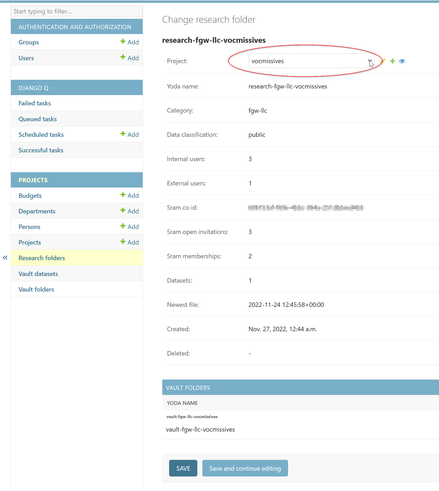

# Yoda administration database

A simple implementation of a "shadow database" to store administrative information and generate usage reports using Django.

The database combines automatically gathered Yoda statistics with manually entered administrative information (owner and budget codes).

## Gathering Yoda statistics
The `irods_tasks.py` at https://github.com/vu-rdm-tech/yoda_report should be run as a cronjob, it will output weekly stats in a json format. 

Sample:
```json
{
    "collections": { 
    // statistics of all Yoda collections (research-, vault-, dataset collections in a Vault)
        "research-staff-surfsram": {
            "size": 42428781421,
            "count": 122,
            "newest": "2023-08-03T12:31:47"
        },
        "research-staff-ubvu-geoplaza": {
            "size": 286556835009,
            "count": 8638,
            "newest": "2024-07-30T14:30:14"
        },
        "research-ub-test-environment": {
            "size": 23828739385,
            "count": 4225,
            "newest": "2024-07-31T14:24:32"
        },
        "vault-staff-surfsram": {
            "size": 0,
            "count": 0,
            "newest": "1970-01-01T00:00:00",
            "datasets": {}
        },
        "vault-staff-ubvu-geoplaza": {
            "size": 0,
            "count": 0,
            "newest": "1970-01-01T00:00:00",
            "datasets": {}
        },
        "vault-ub-test-environment": {
            "size": 23843991440,
            "count": 4262,
            "newest": "2024-07-04T13:25:27",
            "datasets": {
                "dataset1[1712235541]": {
                    "size": 1690087,
                    "count": 3,
                    "original_size": 1687300,
                    "original_count": 2,
                    "create_date": "2024-04-04T14:59:01",
                    "status": "UNPUBLISHED",
                    "retention_period": "10",
                    "data_classification": "Sensitive",
                    "data_access_rights": ""
                },
                "dataset2[1712235552]": {
                    "size": 4426033,
                    "count": 4,
                    "original_size": 4402753,
                    "original_count": 2,
                    "create_date": "2024-04-04T14:59:12",
                    "status": "UNPUBLISHED",
                    "retention_period": "10",
                    "data_classification": "Public",
                    "data_access_rights": ""
                },
                "DataSet3[1677085185]": {
                    "size": 25406,
                    "count": 5,
                    "original_size": 1626,
                    "original_count": 1,
                    "create_date": "2023-02-22T17:59:45",
                    "status": "UNPUBLISHED",
                    "retention_period": "10",
                    "data_classification": "Sensitive",
                    "data_access_rights": ""
                },
                "DataSet3[1687852556]": {
                    "size": 2281310,
                    "count": 6,
                    "original_size": 2259278,
                    "original_count": 3,
                    "create_date": "2023-06-27T09:55:56",
                    "status": "UNPUBLISHED",
                    "retention_period": "10",
                    "data_classification": "Sensitive",
                    "data_access_rights": ""
                },
                "DataSet3[1688559726]": {
                    "size": 2281335,
                    "count": 6,
                    "original_size": 2259268,
                    "original_count": 3,
                    "create_date": "2023-07-05T14:22:06",
                    "status": "UNPUBLISHED",
                    "retention_period": "10",
                    "data_classification": "Sensitive",
                    "data_access_rights": ""
                },
                "DataSet3[1716902500]": {
                    "size": 2281589,
                    "count": 6,
                    "original_size": 2261084,
                    "original_count": 4,
                    "create_date": "2024-05-28T15:21:40",
                    "status": "UNPUBLISHED",
                    "retention_period": "10",
                    "data_classification": "Sensitive",
                    "data_access_rights": ""
                },
                "DataSet3[1716903090]": {
                    "size": 2264757,
                    "count": 6,
                    "original_size": 2261084,
                    "original_count": 4,
                    "create_date": "2024-05-28T15:31:30",
                    "status": "UNPUBLISHED",
                    "retention_period": "10",
                    "data_classification": "Sensitive",
                    "data_access_rights": ""
                },
                "research-ub-test-environment[1720085722]": {
                    "size": 23828740923,
                    "count": 4226,
                    "original_size": 23828739184,
                    "original_count": 4225,
                    "create_date": "2024-07-04T11:35:22",
                    "status": "UNPUBLISHED",
                    "retention_period": "10",
                    "data_classification": "Sensitive",
                    "data_access_rights": ""
                }
            }
        }
    },
    "groups": {
        // All Yoda groups with (read-only) members, parent category and classification
        "datamanager-staff": {
            "category": "staff",
            "data_classification": "NA",
            "members": [
                "******@vu.nl",
                "******@gmail.com",
                "******@vu.nl"
            ],
            "read_members": []
        },
        "datamanager-ub-test": {
        "category": "ub-test",
        "data_classification": "NA",
        "members": [
            "******@vu.nl",
            "******@vu.nl"
        ],
        "read_members": []
        },
        "research-staff-surfsram": {
        "category": "staff",
        "data_classification": "basic",
        "members": [
            "******@vu.nl",
            "******@surf.nl",
            "******@tue.nl",
        ],
        "read_members": []
        },
        "research-staff-ubvu-geoplaza": {
            "category": "staff",
            "data_classification": "public",
            "members": [
                "******@vu.nl",
                "******@gmail.com"
            ],
            "read_members": []
        },
        "research-ub-test-environment": {
            "category": "ub-test",
            "data_classification": "basic",
            "members": [
                "******@vu.nl",
                "******@vu.nl",
                "******@vu.nl"
            ],
            "read_members": []
        }
    },
    "revision_collections": {
    // Collections containing revisions /<zone>/yoda/revisions
        "research-staff-surfsram": {
            "size": 0,
            "count": 0,
            "newest": "1970-01-01T00:00:00"
        },
        "research-staff-ubvu-geoplaza": {
            "size": 136927715048,
            "count": 6412,
            "newest": "2024-07-30T14:16:18"
        },
        "research-ub-test-environment": {
            "size": 0,
            "count": 0,
            "newest": "1970-01-01T00:00:00"
        }
    },
    "misc": {
    // Miscellaneous stats: total sizes and user count
        "size_total": 23369202815701,
        "internal_public_users_total": 410,
        "external_public_users_total": 100,
        "public_users_total": 510,
        "revision_size": 2483090983883,
        "trash_size": 1786259874460,
        "internal_users_total": 352,
        "external_users_total": 145,
        "users_total": 497
    },
    "collected": "20240801"
}

```
In the Django admin a "process irods stats" job should be created that runs `projects.tasks.process_irods_stats`. https://adminyoda.labs.vu.nl/admin/django_q/schedule/

This looks for data files in folder `DATASRC`, processes them and moves them to `DATASRC/archived` when finished. By running it hourly it does not matter when a new datafile is created.

Make sure to set the correct datafolder `DATASRC` in `.env`.
## Dealing with deleted collections
This process cannot detect when a collection is deleted, the collection will just go missing from the datafile. To mark collections as deleted `projects.tasks.cleanup` should be scheduled. It checks if the collections were updated in the latest stats, if not they are marked as deleted. Projects with no associated folders are also marked as deleted. 

Note that the data is not deleted from the database, we want to keep all historical data.
## Adding administrative data
### Editing a project

Using the buttoms you can also open the forms to edit or add _Persons_, _Departments_ and _Budget codes_.

Note that _Research folders_, _Vault folders_ and _Vault datasets_ cannot be edited via the admin interface because these tables are filled automatically.

#### Deleting a project
Since we want to keep historical data you cannot delete a project record. Instead set the _Delete date_ to today.
**Only do this when the project has no active Research Folders attached!**

### Adding research folder/group to a project
You cannot do this in the _project_ form instead go to _Research folders_

Use the dropdown list to select the project this _Research folder_ needs to be added to. You can use the _+_ button to open the _add new project_-form.

### Automatically creating Projects for a new Groups
Most of the statistics are _Project_-based (because a research project could use more than one Yoda Group). For this reason the system expects new Projects to be entered manually, the associated "research folders" can then be added to the project.

Since the manual administration costs time and might be delayed you can also use Django Q to schedule  `projects.tasks.create_projects`. This will automatically create a _Project_ for each orphan _Research Folder_ based on the group/folder name.

Group names are usually formatted: `research-<faculty>-<department>-<projectname>`. A new project will be created with Name _projectname_, _department_ and _faculty_. Owner and Cost Center are set to dummy entries, they can be added in the admin interface later.

- `projects.tasks.create_projects` does not automatically add departments and faculties. If they cannot be found the research folder stays unconnected to a project. Add the Department to the database manually and the `create_projects`-job will create the project when it runs again.

Note that with this process N projects will be created even if all N Yoda groups/folders belong to the same research project. This can easily be rectified by adding all the folders to a single project in the database and setting the extra projects to _Deleted_.

## Customizing the _Projects_ forms and lists
These use the standard Django admin forms and can easily be edited via [projects/admin.py](projects/admin.py), consult the [Django Documentation](https://docs.djangoproject.com/en/4.2/ref/contrib/admin/).
